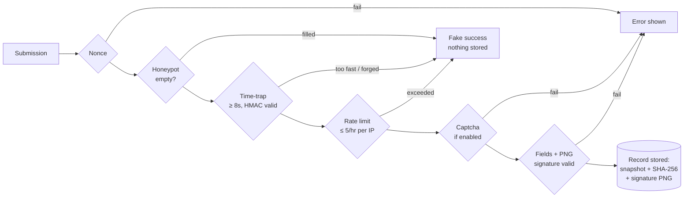

<div align="center">

# 🖋 WP Waiver

**Online waiver signing for WordPress — done properly.**

Admin-editable waiver documents · handwritten signatures · tamper-evident records · layered anti-bot

[](https://github.com/xuanji86/wp-waiver/releases)
[](https://github.com/xuanji86/wp-waiver/actions/workflows/ci.yml)
[](LICENSE)


</div>

---

Every business that puts visitors at real risk — ranges, gyms, climbing walls,
rentals, tours, events — makes them sign a release. Most WordPress "solutions"
bolt a checkbox onto a contact-form plugin and hope for the best. WP Waiver
treats the waiver as what it is: **a legal document with an evidentiary chain**.

- **No form-builder dependency.** Zero third-party plugins.
- **No third-party requests** by default. A captcha loads only if you enable one.
- **No silent evidence loss.** Every record locks in the exact agreement text
  that was signed, hashed, with the signature image, IP, and timestamp.

## Features

|   | |
|---|---|
| 📝 **Editable documents** | Write agreements in the block editor (`Waiver Documents` post type). Multiple documents, WordPress revisions included. |
| ✍️ **Handwritten signature** | Dependency-free canvas pad — mouse, touch, or stylus — plus a typed legal name. Submission is blocked until both exist. |
| 🔏 **Tamper-evident records** | Each signed waiver stores a verbatim snapshot of the agreement *as signed* and its SHA-256. Editing the document later never changes what a record proves. |
| 🛡 **Layered anti-bot** | Honeypot + HMAC time-trap + per-IP rate limit, always on, invisible to humans. Bots get a fake success and nothing is stored. |
| ✅ **Optional captcha** | Google reCAPTCHA v2 or Cloudflare Turnstile — paste two keys, done. |
| 📧 **Email** | Admin notification with the signature PNG attached; optional receipt to the signer with the full agreement text. |
| 🎨 **Themable** | Neutral defaults driven entirely by `--wpw-*` CSS variables; every rule is wrapped in `:where()`, so your theme's overrides always win. |

## Quick start

1. **Install** — download the [latest release zip](https://github.com/xuanji86/wp-waiver/releases)
   (or clone into `wp-content/plugins/wp-waiver`) and activate **WP Waiver**.
2. **Write** — *Waivers → Waiver Documents*: put your agreement in the editor
   and publish. A draft sample is created on activation.
3. **Configure** — *Waivers → Settings*: default document, notification email,
   optional signer receipt and captcha.
4. **Publish** — drop the shortcode on any page:

   ```
   [wp_waiver_form]           → uses the default document
   [wp_waiver_form id="123"]  → pins waiver document #123
   ```

Signed waivers appear under **Waivers → Signed Records** — participant details,
the signature image, and the agreement snapshot with its hash.

## The security model

A submission has to survive five gates before anything is stored:



Why the **time-trap** works so well here: a real person has to read an
agreement and *draw a signature*. A submission arriving eight seconds after the
form was rendered is not a person — and the render timestamp is HMAC-signed
with your site's salts, so it can't be forged or replayed past 24 hours.

Bot verdicts deliberately **fake success**: the attacker sees a confirmation
page, learns nothing, and nothing is stored or emailed. Captcha and validation
failures show a visible error instead — those can be honest humans.

## Captcha setup (optional)

The built-in layers work with zero configuration. To add a visible challenge,
configure a provider under **Waivers → Settings** — the provider's script loads
only when both keys are set, and clearing either key turns it off again.

<details>
<summary><b>Google reCAPTCHA v2 (checkbox)</b></summary>

1. Create keys at <https://www.google.com/recaptcha/admin/create>.
2. **reCAPTCHA type:** choose **Challenge (v2) → "I'm not a robot" Checkbox**.
   Score based (v3) and the Invisible badge are not supported.
3. **Domains:** add your site's domain (subdomains are covered automatically;
   add `localhost` too if you test locally). The Google Cloud Platform section
   can be left at its defaults.
4. Copy the **Site key** and **Secret key** into **Waivers → Settings**, set
   the provider to *Google reCAPTCHA v2 (checkbox)*, and save.

</details>

<details>
<summary><b>Cloudflare Turnstile</b></summary>

1. In the Cloudflare dashboard, open **Turnstile → Add widget** (any Cloudflare
   account works — your site does not need to be behind Cloudflare).
2. **Hostnames:** add your site's domain. Widget mode **Managed** is recommended.
3. Copy the **Site key** and **Secret key** into **Waivers → Settings**, set
   the provider to *Cloudflare Turnstile*, and save.

</details>

**Which one?** reCAPTCHA v2 shows an explicit checkbox; Turnstile is invisible
for most visitors and doesn't involve Google. Both are verified server-side on
every submission.

## Theming

The form ships with clean, neutral styling that works on any theme. To make it
yours, override the CSS variables — no selector fights, guaranteed, because
every plugin rule is wrapped in `:where()` (zero specificity):

```css
.wpw {
  --wpw-text: #eae7db;   --wpw-muted: #9b9683;
  --wpw-panel: #1b1a13;  --wpw-field-bg: #100f0a;
  --wpw-border: #2b2a1f; --wpw-accent: #c99f56; --wpw-accent-text: #14130e;
  --wpw-paper: #e8e6de;  --wpw-ink: #14130e;    /* signature pad */
  --wpw-radius: 0;       --wpw-font: 'Barlow', sans-serif;
}
```

Replace the confirmation panel entirely:

```php
add_filter( 'wpw_confirmation_html', function ( $html, $doc ) {
    return '<div class="wpw-confirm">…your markup…</div>';
}, 10, 2 );
```

## Hooks reference

| Hook | Type | Default | Purpose |
|---|---|---|---|
| `wpw_min_fill_seconds` | filter | `8` | Time-trap: minimum seconds between render and submit |
| `wpw_max_submissions_per_hour` | filter | `5` | Per-IP rate limit |
| `wpw_confirmation_html` | filter | built-in panel | Confirmation markup (`$html, $doc`) |

## Data & privacy

- Records are a **private post type** — visible to admins and editors only.
- Signature PNGs live in `uploads/` under unguessable random filenames.
- Uninstalling removes settings only. **Signed records and documents are legal
  records and are never auto-deleted.**
- No telemetry, no phoning home, no external requests unless you enable a
  captcha provider.

## Contributing & releases

Issues and PRs welcome. CI lints against PHP 7.4 / 8.1 / 8.4.

Releases are automated: bump the `Version:` header in `wp-waiver.php`, add a
[CHANGELOG](CHANGELOG.md) entry, merge to `main` — the release workflow tags
`vX.Y.Z`, builds the installable zip, and publishes it.

## Roadmap

Configurable form fields · PDF export · reCAPTCHA v3 · GDPR export/erase
integration · WordPress.org directory submission

## Disclaimer

This plugin captures signatures and stores records; it is not legal advice.
Whether an electronically signed waiver is enforceable depends on your
jurisdiction and your agreement text — have counsel review both.

## License

[GPL v2 or later](LICENSE)
